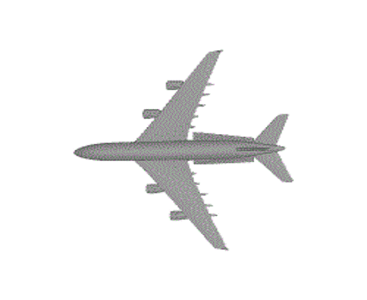
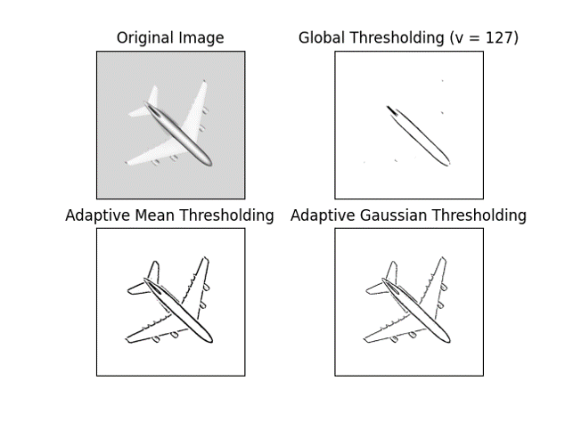

# Synthetic Data Generation in Satellite Imagery (Pipeline)

## Synthetic 3D Objects to Dataset Generation

- Introduction
- 3D .STL Image 
- Transform Angle / Rotation
- Overlay Images – Synthetics Data

## Data augmentation

- Overcome challenge of limited data
- Diversity of the training data
- Smooth out the machine learning model
- Reduce the overfitting of data
- Help improve the performance and results

## 3D STL Image Animation

<!--  -->

## Overlay Images - Synthetic Data Generation

### Convert 3D objects to 2D images with rotation and tilt
.png)
.png)
.png)
.png)
.png)
.png)
<!-- .png) -->

### 2D Image to Tansparent Objects Generation

 
